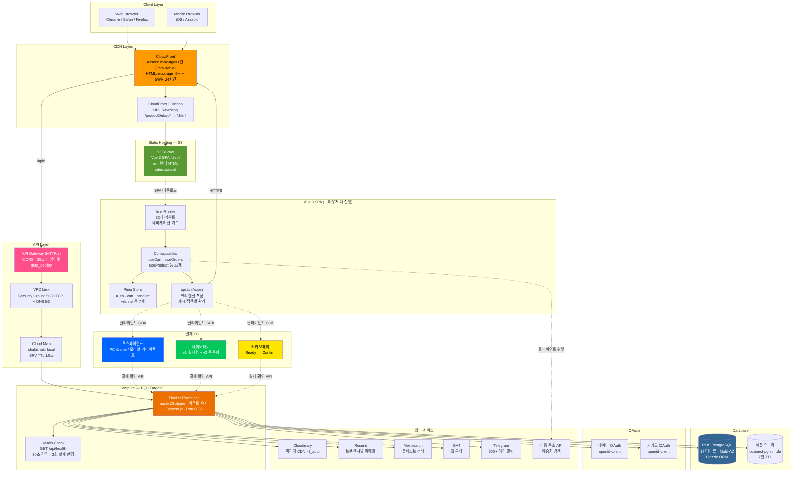

# ShakiShaki Archive — 문제 해결 사례 (검증 완료)

> 모든 수치와 로직은 2026-04-19 기준 실제 코드와 대조 검증됨

---

## 전체 아키텍처 다이어그램



### 아키텍처 요청 흐름 (ASCII)

```
[사용자 브라우저 / 모바일]
         │
         │ HTTPS
         ▼
┌─────────────────────────────────────────────────────────────────┐
│                     CloudFront CDN                               │
│  ┌─────────────────────────────────────────────────────────┐    │
│  │ CloudFront Function: URL Rewriting                       │    │
│  │  /productDetail/slug → /productDetail/slug.html         │    │
│  │  /product/category   → /product/category.html           │    │
│  │  /api/*              → API Gateway (Origin 2)           │    │
│  │  그 외               → /index.html (SPA 폴백)           │    │
│  └─────────────────────────────────────────────────────────┘    │
│                                                                  │
│  캐시 정책:                                                      │
│  ├─ Assets (JS/CSS): max-age=31536000, immutable (1년)          │
│  ├─ HTML:            max-age=300, stale-while-revalidate=86400  │
│  └─ SEO 파일:        max-age=300 (sitemap, robots, llms.txt)   │
└──────────┬──────────────────────────────┬───────────────────────┘
           │ 정적 파일                      │ /api/* 요청
           ▼                               ▼
┌─────────────────┐            ┌──────────────────────────────┐
│   S3 Bucket     │            │   API Gateway (HTTP/2)       │
│   dist/         │            │   CORS: credentials=true     │
│   ├ index.html  │            │   max_age=300                │
│   ├ faq.html    │            │   타임아웃: 30초               │
│   ├ product/    │            │   X-Original-Host 헤더 주입   │
│   ├ productDetail/ │         └──────────┬───────────────────┘
│   ├ sitemap.xml │                       │
│   └ assets/     │                       ▼
└─────────────────┘            ┌──────────────────────────────┐
                               │   VPC Link                   │
                               │   SG: 8080 TCP + DNS 53      │
                               │   AZ: 2a, 2b, 2c (2d 제외)   │
                               └──────────┬───────────────────┘
                                          │
                                          ▼
                               ┌──────────────────────────────┐
                               │   Cloud Map (SRV)            │
                               │   shakishaki.local           │
                               │   TTL: 10초                   │
                               │   Routing: MULTIVALUE         │
                               └──────────┬───────────────────┘
                                          │
                                          ▼
┌─────────────────────────────────────────────────────────────────┐
│                    ECS Fargate (Docker)                          │
│                                                                  │
│  node:20-alpine · 비루트 유저 (expressjs:1001)                    │
│  Express.js 4.21.2 · TypeScript · Port 8080                     │
│  오토스케일링: 1~10 (CPU 70% / Memory 80%)                       │
│                                                                  │
│  ┌─ 미들웨어 체인 ──────────────────────────────────────────┐    │
│  │ Proxy Headers → CORS → Helmet(12) → Rate Limit(5)      │    │
│  │ → Logging → Session → Auth → Zod 검증 → 라우트 핸들러    │    │
│  │ → 전역 에러 핸들러 → Telegram 알림(500+)                  │    │
│  └──────────────────────────────────────────────────────────┘    │
│                                                                  │
│  ┌─ 연동 서비스 ───────────────────────────────────────────────┐ │
│  │                                                             │ │
│  │  [결제]      토스페이먼츠 · 네이버페이(v1+v2) · 카카오페이    │ │
│  │  [OAuth]     네이버 · 카카오 (openid-client)                 │ │
│  │  [이미지]    Cloudinary (CDN, f_auto, 5개 프리셋)            │ │
│  │  [이메일]    Resend (주문확인, 배송알림, 비밀번호 리셋)       │ │
│  │  [검색]      Meilisearch (풀텍스트, 오타 허용)               │ │
│  │  [분석]      GA4 (서비스 계정)                               │ │
│  │  [알림]      Telegram (500+ 에러 실시간)                     │ │
│  │                                                             │ │
│  └─────────────────────────────────────────────────────────────┘ │
└──────────┬──────────────────────────────────────────────────────┘
           │
           ▼
┌─────────────────────────────────────────────────────────────────┐
│                   RDS PostgreSQL (Multi-AZ)                      │
│                                                                  │
│  17 테이블 · Drizzle ORM · SSL (RDS CA 번들)                     │
│  세션 스토어 (connect-pg-simple, 7일 TTL)                        │
│  커넥션 풀: 20/컨테이너                                           │
│                                                                  │
│  주요 테이블:                                                     │
│  users · products · productVariants · orders · orderItems        │
│  cartItems · wishlistItems · returns · stockReservations         │
│  sessions · emailVerifications · inquiries · deliveryAddresses   │
└─────────────────────────────────────────────────────────────────┘


[Vue 3 SPA — 브라우저 내 실행]

┌─────────────────────────────────────────────────────────────────┐
│  Vue Router (32개 라우트)                                        │
│    ├─ 네비게이션 가드 (auth/admin/canonical URL)                  │
│    └─ GA4 페이지뷰 트래킹                                        │
│         │                                                        │
│         ▼                                                        │
│  Vue Components (Composition API + Script Setup)                 │
│    ├─ Pages: auth, product, order, cart, admin, inquiry          │
│    ├─ UI: shadcn/vue + Radix Vue                                │
│    └─ 12개 Composables (비즈니스 로직)                             │
│         │                                                        │
│         ▼                                                        │
│  Pinia Stores (7개)                                              │
│    auth · cart · product · wishlist · category · siteImage       │
│    constants                                                     │
│         │                                                        │
│         ▼                                                        │
│  api.ts (Axios, credentials: include)                            │
│    ├─ GET 캐시 (엔드포인트별):                                    │
│    │   productDetail:3초 / productList:30초 / categories:5분     │
│    │   siteImages:10분 / constants:1시간 / noCache:0ms           │
│    ├─ 뮤테이션 시 관련 캐시 자동 무효화                              │
│    └─ 민감 경로 (auth, payment, address) 캐시 금지                 │
│         │                                                        │
│         ├─── /api/* → CloudFront → API Gateway → ECS            │
│         │                                                        │
│  [프론트엔드 직접 호출]                                            │
│    ├─ 토스페이먼츠 SDK (iframe/리다이렉트 → 백엔드 confirm)         │
│    ├─ 네이버페이 SDK (팝업/앱 → 백엔드 confirm)                    │
│    ├─ 카카오페이 (백엔드 ready → 리다이렉트 → 백엔드 confirm)       │
│    └─ 다음 주소 API (클라이언트 위젯, 백엔드 미경유)                 │
│                                                                  │
└─────────────────────────────────────────────────────────────────┘
```

---

## 사례 1: SPA 프리렌더링 — SNS 공유 & SEO 최적화

### 문제

Vue 3 SPA는 JavaScript 실행 후에만 콘텐츠가 렌더링된다. 카카오톡·네이버·구글 크롤러는 JS를 실행하지 않거나 지연 실행하므로, 상품 링크 공유 시 OG 태그가 비어 있어 미리보기가 표시되지 않았다.

```
[Before — SNS 공유 실패]

사용자가 카카오톡에 상품 링크 공유
         ↓
카카오 크롤러: GET /productDetail/vintage-jacket
         ↓
S3에서 index.html 반환 (빈 <div id="app">)
         ↓
<head>에 OG 태그 없음
         ↓
❌ 미리보기: "샤키샤키 아카이브" (기본 텍스트만)
   상품 이미지·가격·설명 미노출
```

### 해결: 빌드 타임 프리렌더링 + CloudFront Function

전략: SSR 대신 빌드 시점에 Backend SEO API를 호출해 정적 HTML을 생성하고, CloudFront Function으로 URL을 라우팅한다.

```
┌──────────────────────────────────────────────────────────────┐
│                    npm run build:full                         │
│                                                              │
│  Phase 1: Vite Build                                         │
│  ┌────────────────────────────────┐                          │
│  │ vue-tsc → vite build           │                          │
│  │ → dist/index.html (SPA 템플릿)  │                          │
│  └────────────┬───────────────────┘                          │
│               ↓                                              │
│  Phase 2: Prerender Script (scripts/prerender.js, 627줄)     │
│  ┌────────────────────────────────────────────────────────┐  │
│  │ 1. dist/index.html을 템플릿으로 로드                      │  │
│  │ 2. Backend /api/seo/* API 7개 엔드포인트 호출             │  │
│  │    ├─ /seo/home         → 홈 메타 + Organization JSON-LD │  │
│  │    ├─ /seo/faq          → FAQ 메타 + FAQPage JSON-LD    │  │
│  │    ├─ /seo/categories/* → 카테고리별 ItemList JSON-LD    │  │
│  │    ├─ /seo/products/*   → 상품별 Product JSON-LD        │  │
│  │    └─ /seo/sitemap-data → sitemap.xml 데이터             │  │
│  │ 3. OG 태그 + JSON-LD를 <head>에 주입                     │  │
│  │ 4. 페이지별 정적 .html 파일 생성                           │  │
│  │ 5. sitemap.xml 자동 생성                                  │  │
│  │ 6. llms.txt 타임스탬프 갱신                                │  │
│  └────────────────────────────────────────────────────────┘  │
│               ↓                                              │
│         dist/ (최종 출력물)                                    │
│         ├── index.html                  (홈, OG 주입됨)       │
│         ├── faq.html                    (FAQ, 정적 HTML 포함) │
│         ├── product/{category}.html     (카테고리별)           │
│         ├── productDetail/{slug}.html   (상품별)              │
│         ├── sitemap.xml                 (이미지 포함)          │
│         └── assets/                     (JS/CSS, 변경 없음)   │
└──────────────────────────────────────────────────────────────┘
```

### CloudFront Function — URL 라우팅

```
[요청 흐름]

크롤러/사용자 → https://shakishakiarchive.com/productDetail/vintage-jacket
                        ↓
                 CloudFront Function (Viewer Request)
                 ┌─────────────────────────────────────────┐
                 │ *.html, /assets/* → 그대로 통과            │
                 │ /                 → /index.html           │
                 │ /productDetail/*  → /productDetail/*.html │
                 │ /product/*        → /product/*.html       │
                 │ 그 외             → /index.html (SPA 폴백) │
                 └─────────────────────────────────────────┘
                        ↓
                 S3: /productDetail/vintage-jacket.html 반환
                        ↓
                 <head>
                   <meta property="og:title" content="Vintage Jacket">
                   <meta property="og:image" content="https://cdn/.../jacket.jpg">
                   <script type="application/ld+json">
                     { "@type": "Product", "offers": { "price": "45000" } }
                   </script>
                 </head>
                 <body>
                   <div id="app"></div>           ← Vue SPA (JS 실행 시 마운트)
                   <script src="/assets/main.js"></script>
                 </body>
```

### 핵심 구현 사항

| 항목 | 구현 |
|------|------|
| JSON-LD 스키마 | Product, Organization, FAQPage, BreadcrumbList, WebSite, ItemList (6종) |
| XSS 방지 | `escapeHtml()` (5개 특수문자) + `</script>` → `<\/script>` 이스케이프 |
| 대량 상품 | 페이지네이션 (`limit=100`, `hasMore` 체크로 전체 순회) |
| 실패 허용 | API 오류 시 해당 페이지 skip → 빌드 전체 실패 방지 |
| URL 정규화 | 라우터 가드에서 UUID 접근 시 slug URL로 `replace` 리다이렉트 |
| 캐시 전략 | HTML: `max-age=300` (5분), Assets: `max-age=31536000, immutable` (1년) |
| CI/CD | `npm run build:full` = `npm run build && npm run prerender` |

### 결과

```
Before: 카카오톡/네이버 공유 시 → 빈 미리보기 (OG 태그 없음)
After:  상품명 + 이미지 + 가격 + 설명 정상 노출
        구글 Rich Results (가격, 재고, 배송 정보) 표시
```

---

## 사례 2: 주문 재고 차감 — Race Condition 방지 & 3중 복원

### 문제

빈티지 의류는 대부분 1점 한정 상품이다. 동시에 여러 사용자가 같은 상품을 주문하면 재고를 초과 판매(overselling)할 수 있고, 결제 중 브라우저를 닫으면 차감된 재고가 영구히 잠길 수 있다.

### 해결: 즉시 차감 + FOR UPDATE 잠금 + 3중 복원

**설계 선택: Option A (즉시 차감)**
주문 생성 시점에 재고를 차감하고, 결제 실패·취소·만료 시 복원한다. 결제 확인 시점에는 재고 변동 없음(`is_stock_reserved` 플래그로 중복 차감 방지).

```
┌─────────────────────────────────────────────────────────────────────┐
│                      재고 생명주기 (전체 흐름)                         │
├─────────────────────────────────────────────────────────────────────┤
│                                                                     │
│  [1] 주문 생성  POST /api/orders                                     │
│       │                                                             │
│       ├─ Self-Lock Bypass 계산 (본인 pending 주문 재고 가산)            │
│       ├─ SELECT ... FOR UPDATE (행 잠금 획득)                         │
│       ├─ effectiveStock = 실재고 + 본인_예약분                         │
│       ├─ effectiveStock < 요청수량? → ROLLBACK + 에러                 │
│       ├─ UPDATE stock_quantity = stock_quantity - N                  │
│       └─ COMMIT (status: pending_payment, is_stock_reserved: true)  │
│              │                                                      │
│    ┌─────────┼────────────────────┐                                 │
│    ↓         ↓                    ↓                                 │
│  [결제 성공]  [사용자 취소/실패]     [브라우저 종료]                      │
│    │         │                    │                                 │
│    │     cancelOrder API      navigator.sendBeacon                  │
│    │     → 즉시 재고 복원       → POST /cleanup API                  │
│    │         │                    │                                 │
│    │         │     ┌──────────────┘                                 │
│    │         │     ↓                                                │
│    │         │  [Cron 자동 정리]                                     │
│    │         │  1분 간격 체크, 5분 경과 시                              │
│    │         │  restoreStock + DeleteOrder                          │
│    │         │                                                      │
│    ↓         ↓                                                      │
│  [2] 결제 확인                                                       │
│       status → payment_confirmed                                    │
│       재고 변동 없음 (이미 차감됨)                                      │
│       │                                                             │
│       ├─→ [전체 취소]  → PG 환불 API + 재고 복원                       │
│       ├─→ [부분 취소]  → PG 부분환불 + 재고 복원                        │
│       └─→ [반품 승인]  → 관리자 검수 → PG 환불 + 재고 복원              │
│                                                                     │
└─────────────────────────────────────────────────────────────────────┘
```

### Race Condition 방지: FOR UPDATE 행 잠금

```
[동시 주문 시나리오]

Thread 1 (사용자 A)              Thread 2 (사용자 B)
  │                                │
  ├─ BEGIN                         ├─ BEGIN
  │                                │
  ├─ SELECT ... FOR UPDATE ──┐     ├─ SELECT ... FOR UPDATE
  │  (M사이즈 lock 획득)       │     │  (⏳ lock 대기 — 블로킹)
  │                           │     │
  ├─ stock=10, 요청=3          │     │
  ├─ UPDATE 10 → 7             │     │
  ├─ COMMIT ───────────────────┘     │
  │  (lock 해제)                      │
  │                                   ├─ (lock 획득)
  │                                   ├─ stock=7, 요청=8
  │                                   ├─ 7 < 8 → ❌ 재고 부족
  │                                   └─ ROLLBACK

  결과: 재고 10 → 7 (정확), 초과 판매 불가능
  잠금 방식: FOR UPDATE (SKIP LOCKED 아님 — 모든 요청 순차 처리)
```

### Self-Lock Bypass: 본인 재주문 허용

```
[시나리오: 결제창 닫고 재시도]

1차 시도:
  POST /api/orders → M사이즈 × 5개
  재고: 10 → 5 (차감됨)
  상태: pending_payment
  → 결제창 열었다가 닫음 (주문 아직 살아있음)

2차 시도 (같은 사용자, 같은 상품):
  POST /api/orders → M사이즈 × 5개

  ┌─ Self-Lock Bypass ──────────────────────────────────┐
  │                                                      │
  │  1. 본인의 pending/paying 주문 조회 (10분 이내)         │
  │     SQL: WHERE user_id = $1                          │
  │          AND status IN ('pending_payment', 'paying') │
  │          AND created_at > NOW() - INTERVAL '10 min'  │
  │     → 1차 주문 발견: M사이즈 × 5개                     │
  │                                                      │
  │  2. userReservedStock Map 구성                        │
  │     key: "{productId}-m" → value: 5                  │
  │                                                      │
  │  3. 유효 재고 계산                                     │
  │     effectiveStock = currentStock(5) + reserved(5)   │
  │                    = 10                               │
  │     10 >= 요청(5) → ✅ 주문 가능                       │
  │                                                      │
  │  4. 재고 차감: 5 → 0                                  │
  └──────────────────────────────────────────────────────┘

  5분 후 Cron 정리:
    1차 주문 만료 → 재고 복원: 0 → 5
    2차 주문은 유효하게 유지 (재고 = 5)
```

### 3중 재고 복원 메커니즘

```
┌─────────────────────────────────────────────────────────────────┐
│                   재고 복원 경로 3가지                              │
├──────────┬──────────────┬───────────────────────────────────────┤
│  경로     │  트리거        │  동작                                 │
├──────────┼──────────────┼───────────────────────────────────────┤
│  경로 1   │ 사용자 취소    │ cancelOrderBeforePayment()           │
│  (즉시)   │ 버튼 클릭      │ → 트랜잭션 내 재고 복원               │
│          │              │ → 사이즈 매칭: LOWER(TRIM(size))      │
├──────────┼──────────────┼───────────────────────────────────────┤
│  경로 2   │ 브라우저 닫기   │ navigator.sendBeacon()              │
│  (비동기)  │ (탭/창 종료)   │ → POST /api/orders/:id/cleanup     │
│          │              │ → pending_payment만 정리              │
│          │              │ → paying 상태는 보호 (결제 진행 중)     │
├──────────┼──────────────┼───────────────────────────────────────┤
│  경로 3   │ 시간 만료      │ Cron (1분 간격)                      │
│  (자동)   │ (5분 경과)     │ → pending_payment/paying 주문 조회   │
│          │              │ → restoreStockAndDeleteOrder()       │
│          │              │ → 재고 복원 + 주문 삭제 (트랜잭션)      │
└──────────┴──────────────┴───────────────────────────────────────┘
```

### 사이즈 정규화 (복원 정확성 보장)

```
주문 시 저장:   options = "Size: X Large"
복원 시 추출:   /Size:\s*(.+?)$/im  →  "X Large"
정규화 함수:    trim().toLowerCase()  →  "x large"
DB 매칭 쿼리:   WHERE LOWER(TRIM(size)) = 'x large'

폴백: 사이즈 추출 실패 시 → 해당 상품의 첫 번째 variant(created_at ASC) 복원
```

### 프론트엔드 결제창 감시

```
[토스페이먼츠 결제창 모니터링]

결제창 오픈
  ↓
setInterval(1초 간격, 최대 180회 = 3분)
  │
  ├─ 결제 콜백 처리 중? → 모니터링 중단 (정상 흐름)
  ├─ 주문 ID 없음?     → 모니터링 중단 (이미 처리됨)
  ├─ 결제창 닫힘 감지?  → cancelOrder() 호출 → 재고 복원
  └─ 180회 도달?       → 타임아웃 에러 표시
```

### 핵심 수치

| 항목 | 값 |
|------|-----|
| 잠금 방식 | `SELECT ... FOR UPDATE` (행 잠금, 순차 처리) |
| Self-Lock 조회 범위 | 10분 이내 pending/paying 주문 |
| 주문 만료 시간 | 5분 (`MAX_PENDING_AGE_MS`) |
| Cron 체크 간격 | 1분 (`INTERVAL_MS`) |
| 결제창 폴링 | 1초 × 180회 = 3분 |
| `is_stock_reserved` | 주문 생성 시 true → 결제 확인 시 재고 재차감 방지 |

---

## 사례 3: 배송비 계산 & 무료배송 페널티 — 공정한 환불 설계

### 문제

무료배송(7만원 이상) 혜택을 받은 주문에서 부분 취소로 남은 금액이 7만원 미만이 되면, 무료배송 혜택을 소급 회수해야 한다. 단, 판매자 귀책 취소로 기준이 무너진 경우에는 고객에게 페널티를 부과하면 안 된다. 또한 여러 번 부분 취소해도 페널티는 1회만 부과해야 한다.

### 기본 배송비 계산

```
┌─────────────────────────────────────────────────────┐
│        calculateShippingFee(subtotal, postalCode)    │
├─────────────────────────────────────────────────────┤
│                                                     │
│  subtotal >= 70,000원?                               │
│     YES → baseFee = 0원 (무료배송)                   │
│     NO  → baseFee = 3,500원                         │
│                                                     │
│  도서산간 지역? (isRemoteArea — 30+ 우편번호 범위)     │
│     YES → baseFee += 2,500원 (무료배송이어도 가산)    │
│     NO  → 변동 없음                                  │
│                                                     │
│  return baseFee                                     │
└─────────────────────────────────────────────────────┘

 상수값 (shared/constants/shipping.ts)
 ┌───────────────────┬──────────┐
 │ FREE_THRESHOLD    │ 70,000원 │
 │ FEE               │  3,500원 │
 │ EXTRA_FEE (도서산간)│  2,500원 │
 │ RETURN (반품 편도)  │  3,500원 │
 └───────────────────┴──────────┘

 예시:
 ┌──────────┬────────┬────────┐
 │ 상품금액  │ 지역    │ 배송비  │
 ├──────────┼────────┼────────┤
 │ 80,000원 │ 서울    │    0원 │
 │ 60,000원 │ 서울    │ 3,500원│
 │ 80,000원 │ 제주    │ 2,500원│
 │ 60,000원 │ 제주    │ 6,000원│
 └──────────┴────────┴────────┘
```

### 환불 시나리오 4가지 (calculateRefund)

```
┌───────────────────────────────────────────────────────────────────────┐
│                      환불 계산 의사결정 트리                              │
├───────────────────────────────────────────────────────────────────────┤
│                                                                       │
│  배송 전 (isAfterShipping = false)?                                    │
│  │                                                                    │
│  ├─ YES (배송 전)                                                      │
│  │   │                                                                │
│  │   ├─ 마지막 상품? (isLastItems)                                     │
│  │   │   YES → 환불 = 상품값 + 결제한 배송비 전액                        │
│  │   │   NO  → 환불 = 상품값만 (배송비 유지)                             │
│  │   │                                                                │
│  │   └─ + calculatePenalty() 적용                                      │
│  │                                                                    │
│  └─ NO (배송 후)                                                       │
│      │                                                                │
│      ├─ 판매자 귀책? (isSellerFault)                                   │
│      │   │                                                            │
│      │   ├─ YES                                                       │
│      │   │   ├─ 마지막 → 환불 = 상품값 + 배송비 (페널티 없음)            │
│      │   │   └─ 부분  → 환불 = 상품값만 (페널티 없음)                    │
│      │   │                                                            │
│      │   └─ NO (고객 귀책)                                             │
│      │       ├─ 마지막 → 환불 = 상품값 + 배송비 - 이미사용배송비 - 페널티 │
│      │       └─ 부분  → 환불 = 상품값 - 페널티                          │
│      │                                                                │
│      └─ 페널티 = calculatePenalty()                                    │
│                                                                       │
└───────────────────────────────────────────────────────────────────────┘
```

### 페널티 계산 로직 (calculatePenalty)

```
┌────────────────────────────────────────────────────────────────┐
│              calculatePenalty() — 5단계 의사결정                  │
├────────────────────────────────────────────────────────────────┤
│                                                                │
│  [1] 유료배송 주문이었나?                                        │
│      hadFreeShippingBenefit(paidShippingFee) = false?           │
│      (paidShippingFee가 0도 아니고 2,500원도 아닌 경우)           │
│      YES → return { penalty: 0 }  (이미 배송비 냈으므로)         │
│      NO  ↓                                                     │
│                                                                │
│  [2] 가상 남은 금액 계산                                         │
│      virtualRemaining = remainingAmount + sellerCancelledAmount │
│      (판매자 귀책 취소분은 고객 보호를 위해 가산)                   │
│                                                                │
│  [3] virtualRemaining >= 70,000원?                              │
│      YES → return { penalty: 0 }  (무료배송 기준 유지)           │
│      NO  ↓                                                     │
│                                                                │
│  [4] 이미 페널티 적용됨? (penaltyAlreadyApplied flag)            │
│      YES → return { penalty: 0 }  (중복 부과 방지)              │
│      NO  ↓                                                     │
│                                                                │
│  [5] return { penalty: 3,500원, shouldUpdateFlag: true }        │
│      → DB에 shippingPenaltyApplied = true 갱신                 │
│                                                                │
└────────────────────────────────────────────────────────────────┘

  ※ sellerCancelledAmount는 함수 시그니처에 존재하나(default=0),
     현재 라우트 호출부에서 값을 전달하지 않아 미활성 상태.
     향후 판매자 직권 취소 시 고객 보호용으로 활성화 예정.
```

### 다중 부분 취소 시 페널티 플래그 동작

```
[주문: 상품 A(30,000) + B(30,000) + C(30,000) = 90,000원, 무료배송]

━━━ 1차 부분 취소: 상품 A (30,000원) ━━━━━━━━━━━━━━━━━━━━━━━━━━━━━━

  남은 금액: 60,000원 < 70,000원 (무료배송 기준 미달)
  hadFreeShippingBenefit = true  (배송비 0원 결제)
  penaltyAlreadyApplied = false  (최초)

  → 페널티 = 3,500원 ✅
  → DB: shippingPenaltyApplied = true
  → 환불 = 30,000 - 3,500 = 26,500원
  → 재고: 상품 A 복원 ✅

━━━ 2차 부분 취소: 상품 B (30,000원) ━━━━━━━━━━━━━━━━━━━━━━━━━━━━━━

  남은 금액: 30,000원 < 70,000원
  penaltyAlreadyApplied = true  (이미 적용됨)

  → 페널티 = 0원 (중복 부과 방지)
  → 환불 = 30,000원
  → 재고: 상품 B 복원 ✅

━━━ 마지막 취소: 상품 C (30,000원) ━━━━━━━━━━━━━━━━━━━━━━━━━━━━━━━━

  마지막 상품 → 결제한 배송비(0원) 환불 대상
  추가 페널티: 0원

  → 환불 = 30,000원
  → 재고: 상품 C 복원 ✅

━━━━━━━━━━━━━━━━━━━━━━━━━━━━━━━━━━━━━━━━━━━━━━━━━━━━━━━━━━━━━━━━
  총 결제:  90,000원 (배송비 0원)
  총 환불:  26,500 + 30,000 + 30,000 = 86,500원
  총 페널티: 3,500원 (1회만 부과)
```

### hadFreeShippingBenefit 판단 기준

```
┌──────────────────┬──────────────────────────────┬────────────┐
│ paidShippingFee  │ 의미                          │ 무료배송?   │
├──────────────────┼──────────────────────────────┼────────────┤
│ 0원              │ 일반 지역 + 7만원 이상          │ YES        │
│ 2,500원          │ 도서산간 + 7만원 이상 (추가만)   │ YES        │
│ 3,500원          │ 일반 지역 + 7만원 미만          │ NO         │
│ 6,000원          │ 도서산간 + 7만원 미만           │ NO         │
└──────────────────┴──────────────────────────────┴────────────┘

무료배송 주문(YES)에서만 페널티 대상이 됨
```

### 프론트엔드-백엔드 상수 동기화

```
┌─────────────────────────────────┐     ┌──────────────────────────────┐
│ Backend                         │     │ Frontend                     │
│ shared/constants/shipping.ts    │     │ src/lib/validators.ts        │
│                                 │     │                              │
│ FREE_THRESHOLD: 70000           │ ──→ │ FALLBACK_SHIPPING:           │
│ FEE:            3500            │     │   FREE_THRESHOLD: 70000      │
│ EXTRA_FEE:      2500            │     │   FEE: 3500                  │
│                                 │     │   EXTRA_FEE: 2500            │
└─────────────────────────────────┘     └──────────────────────────────┘
                                               ↑
                                        런타임 동기화:
                                        GET /api/constants → Pinia store
                                        (FALLBACK은 API 실패 시 사용)
```

### 핵심 수치

| 항목 | 값 |
|------|-----|
| 무료배송 기준 | 70,000원 |
| 기본 배송비 | 3,500원 |
| 도서산간 추가 | 2,500원 |
| 반품 배송비 (편도) | 3,500원 |
| 페널티 최대 부과 횟수 | 1회 (`shippingPenaltyApplied` 플래그) |
| 환불 시나리오 | 4가지 (배송전/후 × 판매자/고객 귀책) |
| 도서산간 우편번호 범위 | 30+ 엔트리 (제주, 인천 섬지역 등) |

---

## 포트폴리오 어필 요약

| 사례 | 문제 | 해결 | 핵심 어필 |
|------|------|------|----------|
| **프리렌더링** | SPA에서 SNS 공유 시 OG 태그 미노출 | 빌드 타임 프리렌더링 + CloudFront Function URL 라우팅 | JSON-LD 6종, XSS 방지, 실패 허용 설계, 캐시 전략 |
| **재고 차감** | 동시 주문 시 초과 판매 + 브라우저 종료 시 재고 잠김 | 즉시 차감 + `FOR UPDATE` 행 잠금 + 3중 복원 | Self-Lock Bypass, sendBeacon, Cron 자동 정리 |
| **배송비 페널티** | 부분 취소 시 무료배송 혜택 소급 회수의 공정성 | 4가지 환불 시나리오 분기 + 페널티 1회 제한 플래그 | `penaltyAlreadyApplied` 중복 방지, 프론트-백엔드 상수 동기화 |

---

## 사례 4: CI/CD 파이프라인 — 프론트엔드 45초 배포 & 백엔드 무중단 배포

### 문제

1인 개발 환경에서 수동 배포는 실수와 다운타임을 유발한다. 프론트엔드 정적 자산의 캐시 무효화, 백엔드의 무중단 롤링 업데이트, 인프라 변경의 코드화가 필요했다.

### 해결: GitHub Actions + AWS 자동화

```
┌─────────────────────────────────────────────────────────────────────┐
│                    전체 배포 아키텍처                                  │
├─────────────────────────────────────────────────────────────────────┤
│                                                                     │
│  [Frontend]  git push main                                          │
│       ↓                                                             │
│  GitHub Actions (.github/workflows/deploy.yml)                      │
│       │                                                             │
│       ├─ npm ci (캐시됨)                                             │
│       ├─ npm run build:full (vue-tsc + vite build + prerender)      │
│       ├─ AWS 인증 (Access Key 기반)                                  │
│       ├─ S3 Sync                                                    │
│       │   ├─ assets/: max-age=31536000, immutable (1년)             │
│       │   └─ HTML:    max-age=300, stale-while-revalidate=86400     │
│       └─ CloudFront 캐시 무효화                                      │
│           ├─ 일반: 선택적 (6개 경로)                                  │
│           └─ 태그/[full-invalidate]: 전체 (/*,  ~$10)               │
│                                                                     │
│  [Backend]  git push main                                           │
│       ↓                                                             │
│  GitHub Actions (.github/workflows/deploy-ecr.yml)                  │
│       │                                                             │
│       ├─ Docker 멀티스테이지 빌드 (GHA 레이어 캐시)                    │
│       │   ├─ Stage 1 (deps):    npm ci --only=production            │
│       │   ├─ Stage 2 (builder): esbuild 번들링                      │
│       │   └─ Stage 3 (runner):  node:20-alpine + 비루트 유저         │
│       ├─ ECR Push (태그: v1.2.0 + latest + sha)                     │
│       ├─ ECS 태스크 정의 업데이트                                     │
│       └─ ECS 롤링 배포 (wait-for-service-stability=true)             │
│           ├─ 신규 태스크 시작                                         │
│           ├─ 헬스체크 통과 (GET /api/health, 30초 간격)               │
│           ├─ ALB 타겟 그룹 등록                                      │
│           ├─ 구 태스크 드레인 (30초)                                  │
│           └─ 구 태스크 종료                                          │
│                                                                     │
│  [Infrastructure]  Terraform (terraform/environments/prod/)          │
│       ├─ API Gateway (HTTP/2) + CORS + 30초 타임아웃                  │
│       ├─ VPC Link + Security Group (8080 포트만 허용)                 │
│       ├─ Cloud Map (shakishaki.local, SRV 레코드, TTL 10초)          │
│       ├─ CloudWatch Logs (30일 보관, JSON 구조화)                     │
│       └─ 원격 상태: S3 버킷 + DynamoDB 잠금 (동시 apply 방지)         │
│                                                                     │
└─────────────────────────────────────────────────────────────────────┘
```

### CloudFront 캐시 무효화 전략

```
┌────────────────────────────────────────────────────────────────┐
│                캐시 무효화 의사결정                                │
├────────────────────────────────────────────────────────────────┤
│                                                                │
│  트리거 조건 확인:                                               │
│  ├─ v* 태그 푸시?                    → 전체 무효화 (/*)          │
│  ├─ 커밋 메시지에 [full-invalidate]?  → 전체 무효화 (/*)          │
│  ├─ workflow_dispatch full=true?     → 전체 무효화 (/*)          │
│  └─ 일반 main 푸시?                  → 선택적 무효화             │
│                                                                │
│  선택적 무효화 경로 (6개):                                       │
│  /index.html /product/* /productDetail/*                       │
│  /sitemap.xml /robots.txt /llms.txt                            │
│  비용: ~$0.035/배포, 대기: 최대 5분                              │
│                                                                │
│  전체 무효화:                                                    │
│  /* (모든 경로)                                                  │
│  비용: ~$10/배포, 대기: 최대 10분                                │
│                                                                │
└────────────────────────────────────────────────────────────────┘
```

### Docker 멀티스테이지 빌드

```
┌─ Stage 1: deps ──────────────────────┐
│ FROM node:20-alpine                  │
│ npm ci --only=production             │
│ → 프로덕션 의존성만 설치               │
│ → package.json 변경 없으면 캐시 히트   │
└──────────────┬───────────────────────┘
               ↓
┌─ Stage 2: builder ───────────────────┐
│ FROM node:20-alpine                  │
│ npm ci (devDeps 포함)                │
│ npm run build (esbuild → dist/)     │
│ → TypeScript 컴파일 + 번들링          │
└──────────────┬───────────────────────┘
               ↓
┌─ Stage 3: runner ────────────────────┐
│ FROM node:20-alpine                  │
│ 비루트 유저 (expressjs, UID 1001)     │
│ RDS SSL CA 번들 다운로드              │
│ COPY --from=deps node_modules        │
│ COPY --from=builder dist/            │
│ HEALTHCHECK 30초 간격, 3회 실패 시    │
│ CMD ["node", "dist/index.js"]        │
│ → 최종 이미지: ~150-200MB (Alpine)    │
└──────────────────────────────────────┘
```

### Terraform IaC 구성

```
terraform/
├── backend/
│   └─ main.tf
│      ├─ S3 버킷 (상태 저장, 버전관리, AES256 암호화)
│      ├─ DynamoDB (상태 잠금, PAY_PER_REQUEST)
│      └─ 퍼블릭 액세스 차단
│
└── environments/prod/
    ├─ api-gateway.tf
    │   ├─ HTTP API v2 (protocol: HTTP)
    │   ├─ CORS: credentials=true, max_age=300
    │   ├─ VPC Link 통합 (Cloud Map SRV → ECS)
    │   ├─ 라우트: ANY / + ANY /{proxy+}
    │   ├─ 헤더 주입: X-Original-Host, X-Original-Proto
    │   └─ auto_deploy: true
    │
    ├─ vpc-link.tf
    │   ├─ Security Group (8080 TCP + DNS 53 UDP/TCP)
    │   ├─ ECS SG에 인바운드 규칙 추가
    │   └─ AZ 호환성 필터 (ap-northeast-2d 제외)
    │
    ├─ service-discovery.tf
    │   ├─ Private DNS (shakishaki.local, VPC 스코프)
    │   └─ SRV 레코드 (TTL 10초, failure_threshold 1)
    │
    └─ cloudfront.tf
        └─ 수동 관리 (안전한 롤백 위해 Terraform 미적용)
```

### 핵심 수치

| 항목 | Frontend | Backend |
|------|----------|---------|
| 배포 트리거 | main 푸시 / v* 태그 | main 푸시 / v* 태그 / 수동 |
| AWS 인증 | Access Key | OIDC Role (키 없음) |
| 빌드 | vue-tsc + vite + prerender | esbuild (ESM) |
| 배포 대상 | S3 + CloudFront | ECR + ECS Fargate |
| 무중단 | 캐시 무효화 (선택적/전체) | 롤링 업데이트 + 헬스체크 |
| 롤백 | CloudFront 즉시 Origin 변경 | ECS 이전 태스크 정의 재배포 |
| 이미지 태그 | — | semantic + latest + sha(7자) |
| Docker 캐시 | — | GHA 레이어 캐시 (5일 보관) |
| 로그 보관 | — | CloudWatch 30일 |

---

## 사례 5: 보안 — 다계층 방어 체계 (OWASP Top 10 대응)

### 문제

이커머스 서비스는 결제 정보, 개인정보, 인증 정보를 다루므로 보안 사고 시 직접적인 금전 피해로 이어진다. 1인 개발 MVP에서도 보안은 타협할 수 없었다.

### 해결: 15개 보안 메커니즘의 다계층 방어

```
┌─────────────────────────────────────────────────────────────────────┐
│                     요청 처리 보안 체인                                │
├─────────────────────────────────────────────────────────────────────┤
│                                                                     │
│  [1] Proxy Headers 미들웨어                                          │
│      X-Original-Host/Proto/Cookie → 표준 헤더 변환                   │
│      (API Gateway 경유 시 원본 정보 복원)                              │
│         ↓                                                           │
│  [2] CORS 검증                                                      │
│      allowedOrigins 화이트리스트 매칭                                  │
│      실패 시 logger.warn() 기록                                      │
│         ↓                                                           │
│  [3] Helmet 보안 헤더 (12개)                                         │
│      ┌──────────────────────────────────────────┐                   │
│      │ CSP: script-src 'self' 'unsafe-inline'   │                   │
│      │ X-Frame-Options: deny (클릭재킹 방지)     │                   │
│      │ HSTS: 1년 (31,536,000초, prod only)       │                   │
│      │ X-Content-Type-Options: nosniff           │                   │
│      │ Referrer-Policy: strict-origin-cross      │                   │
│      │ X-Powered-By: 제거 (서버 지문 은닉)        │                   │
│      │ COOP: same-origin                         │                   │
│      │ CORP: cross-origin                        │                   │
│      └──────────────────────────────────────────┘                   │
│         ↓                                                           │
│  [4] Global Rate Limiter (1,000req / 15분, IP 기반)                  │
│      /health, /api/admin/* 제외                                     │
│         ↓                                                           │
│  [5] Request Logging (민감 데이터 자동 마스킹)                         │
│      password, token, secret, authorization,                        │
│      cookie, apikey, creditcard, cvv → "[MASKED]"                   │
│         ↓                                                           │
│  [6] 엔드포인트별 Rate Limiter                                       │
│      ┌──────────────────────────────────────────┐                   │
│      │ Auth:     15req / 15분 (Brute Force 방지) │                   │
│      │ Email:     3req /  5분 (비용 제어)         │                   │
│      │ Payment:  10req /  1분 (userId 기반)       │                   │
│      │ Admin:   300req /  5분 (userId 기반)       │                   │
│      └──────────────────────────────────────────┘                   │
│         ↓                                                           │
│  [7] 세션 인증 (isAuthenticated)                                     │
│      PostgreSQL 세션 스토어, 7일 TTL                                 │
│      쿠키: httpOnly + secure + sameSite                              │
│         ↓                                                           │
│  [8] 권한 검증 (isAdmin)                                             │
│      메모리 캐시 (5분 TTL), 로그아웃 시 무효화                          │
│         ↓                                                           │
│  [9] 입력 검증 (Zod 스키마)                                          │
│      모든 사용자 입력 런타임 검증                                      │
│         ↓                                                           │
│  [10] 라우트 핸들러 (asyncHandler 자동 에러 캐치)                      │
│         ↓                                                           │
│  [11] 전역 에러 핸들러                                                │
│       500+ 에러: Telegram 실시간 알림 (fire-and-forget)               │
│       prod: "Internal Server Error" (스택 미노출)                    │
│       dev: 에러명 + 코드 + 스택 10줄                                 │
│                                                                     │
└─────────────────────────────────────────────────────────────────────┘
```

### PII 마스킹 체계 (9가지 함수)

```
┌─────────────────────────────────────────────────────────────────┐
│                    개인정보 마스킹 규칙                             │
├───────────┬─────────────────────┬───────────────────────────────┤
│ 대상       │ 원본                 │ 마스킹 결과                    │
├───────────┼─────────────────────┼───────────────────────────────┤
│ 이메일     │ test@gmail.com      │ t**t@gmail.com               │
│ 전화번호   │ 01012345678         │ 010-****-5678                │
│ 주소       │ 서울시 강남구 테헤란로 │ 서울시 강남구 테헤***          │
│ 상세주소   │ 101동 1504호         │ ***                          │
│ 이름       │ 홍길동               │ 홍*동                        │
│ 이름(2자)  │ 김철                 │ 김*                          │
├───────────┴─────────────────────┴───────────────────────────────┤
│ 적용 위치:                                                       │
│  ├─ 로그 출력 (logger.middleware.ts)                              │
│  ├─ API 응답 (maskUserObject / maskAdminUserObject /             │
│  │            maskUserForPublicView / maskUserForInquiryView)    │
│  ├─ 문의 목록 (maskUserForInquiryView — 본인은 풀 공개)           │
│  └─ 에러 알림 (Telegram — userId + email만)                      │
│                                                                  │
│ 소셜 ID: naverId, kakaoId → 항상 null 반환                       │
│ passwordHash: sanitizeUserObject()에서 제거                       │
└──────────────────────────────────────────────────────────────────┘
```

### 일회용 이메일 차단

```
disposable-emails.ts: 187개 도메인 차단
  ├─ Set 자료구조 (O(1) 조회)
  ├─ tempmail.com, guerrillamail.com, mailinator.com, yopmail.com ...
  └─ 회원가입 시 도메인 추출 → Set.has() 검증 → 차단
```

### 비밀번호 보안

```
┌─────────────────────────────────────────────┐
│ bcryptjs (SALT_ROUNDS = 10)                 │
│ ├─ hashPassword(): genSalt(10) → hash()    │
│ ├─ verifyPassword(): compare() 상수 시간   │
│ └─ 해싱 비용: ~100ms/회 (타이밍 공격 방지)   │
│                                             │
│ 비밀번호 규칙 (shared/constants/validation)  │
│ ├─ 최소 8자                                 │
│ └─ 대문자/소문자/숫자/특수문자 중 3종 이상    │
│                                             │
│ 인증코드: 6자리 (100000~999999), 10분 만료   │
└─────────────────────────────────────────────┘
```

### 환경변수 검증 (서버 시작 시)

```
┌────────────────────────────────────────────────────┐
│ server/config/index.ts — 시작 시 필수 검증            │
├────────────────────────────────────────────────────┤
│                                                    │
│ 필수 (누락 시 서버 시작 실패):                        │
│   DATABASE_URL:    PostgreSQL 연결 문자열            │
│   SESSION_SECRET:  세션 암호화 키 (32자 이상 권장)    │
│                                                    │
│ 선택 (누락 시 해당 기능 비활성화):                     │
│   CORS_ORIGINS, TOSS_SECRET_KEY, NAVER_CLIENT_ID,  │
│   KAKAO_CLIENT_ID, RESEND_API_KEY, TELEGRAM_BOT_TOKEN │
│   → isEnabled 플래그로 조건부 활성화                  │
│                                                    │
│ Rate Limit 오버라이드 (환경별 조정):                   │
│   RATE_LIMIT_WINDOW_MS, RATE_LIMIT_MAX_REQUESTS    │
│   RATE_LIMIT_ENABLE_IN_DEV                         │
│                                                    │
└────────────────────────────────────────────────────┘
```

### OWASP Top 10 대응 매핑

| OWASP | 위협 | 대응 |
|-------|------|------|
| A01 접근 제어 | 권한 없는 리소스 접근 | isAuthenticated + isAdmin 미들웨어, userId 격리 쿼리 |
| A02 암호화 | 평문 전송·저장 | HTTPS(HSTS 1년), bcrypt(10라운드), httpOnly 쿠키 |
| A03 인젝션 | SQL Injection | Drizzle ORM 파라미터화 쿼리, Zod 입력 검증 |
| A04 설계 결함 | 인증 우회 | 세션 기반 인증 + Rate Limiting 5단계 |
| A05 설정 오류 | 헤더 미설정 | Helmet 12개 보안 헤더, CORS 화이트리스트 |
| A06 취약 컴포넌트 | 알려진 취약점 | npm audit, 의존성 관리 |
| A07 인증 실패 | Brute Force | Auth 15req/15min, 비밀번호 복잡도, 일회용 이메일 차단(187개) |
| A08 데이터 무결성 | 변조 | PostgreSQL ACID, 트랜잭션 + SAVEPOINT |
| A09 로깅 부족 | 침입 미탐지 | 구조화 JSON 로깅, 민감 데이터 마스킹, Telegram 알림 |
| A10 SSRF | 내부 네트워크 접근 | HTTP 클라이언트 타임아웃(5초), 외부 API 화이트리스트 |

### 핵심 수치

| 항목 | 값 |
|------|-----|
| 보안 헤더 | 12개 (Helmet) |
| Rate Limiter | 5개 (Global, Auth, Email, Payment, Admin) |
| 세션 TTL | 7일 (604,800,000ms) |
| 유저 캐시 TTL | 5분 (300,000ms) |
| HSTS Max-Age | 1년 (31,536,000초) |
| 비밀번호 해싱 | bcrypt 10라운드 (~100ms) |
| 인증코드 | 6자리, 10분 만료 |
| 일회용 이메일 차단 | 187개 도메인 |
| 민감 키 마스킹 | 15개 패턴 |
| 로그 스택 트레이스 | 최대 10줄 |
| 응답 로그 최대 크기 | 2,000자 (초과 시 truncate) |

---

## 사례 6: Lighthouse 성능 최적화 — 전송 크기 68% 감소

### 문제

초기 사이트의 전체 전송 크기가 6.9MB에 달했다. Hero 이미지(2.65MB), 웹 폰트(1.5MB), 미최적화 이미지(2.0MB)가 주원인으로 LCP 31.8초, FCP 14.7초로 사용자 이탈 위험이 높았다.

### 해결: 4단계 체계적 최적화

```
┌─────────────────────────────────────────────────────────────────────┐
│                   4단계 최적화 여정                                    │
├─────────────────────────────────────────────────────────────────────┤
│                                                                     │
│  [Stage 1] Baseline (최적화 전)                                      │
│  ├─ Performance: 55점                                               │
│  ├─ LCP: 31.8s / FCP: 14.7s / TTI: 32.0s                          │
│  └─ 전송 크기: 6.9 MB                                               │
│         ↓                                                           │
│  [Stage 2] 폰트 서브셋 + WebP 변환                                   │
│  ├─ Pretendard 풀폰트 → 한글+ASCII 서브셋 (1.5MB → 806KB, -46%)     │
│  ├─ PNG/JPEG → WebP 변환 (2.0MB → 195KB, -90%)                     │
│  ├─ Performance: 63점 (+8)                                          │
│  ├─ LCP: 16.9s (-47%) / FCP: 4.7s (-68%)                          │
│  └─ 전송 크기: 3.7 MB (-46%)                                        │
│         ↓                                                           │
│  [Stage 3] Hero 이미지 리사이징 (5556px → 2400px)                    │
│  ├─ Hero: 2.65MB → 376KB (-86%)                                    │
│  ├─ Performance: 62점                                               │
│  ├─ LCP: 11.8s (-30% from Stage 2)                                 │
│  └─ 전송 크기: 2.5 MB (-32%)                                        │
│         ↓                                                           │
│  [Stage 4] Hero 극한 최적화 (2400px → 800px, Q28)                    │
│  ├─ Hero: 376KB → 50KB (-87%)                                      │
│  ├─ Performance: 62점 (유지)                                        │
│  ├─ LCP: 10.6s (-10% from Stage 3)                                 │
│  └─ 전송 크기: 2.2 MB (-12%)                                        │
│                                                                     │
│  [최종 결과]                                                         │
│  ├─ Performance: 55 → 62점 (+7, +12.7%)                             │
│  ├─ LCP:  31.8s → 10.6s (-66.7%, 3배 빨라짐)                        │
│  ├─ FCP:  14.7s →  4.7s (-68.0%, 3배 빨라짐)                        │
│  ├─ TTI:  32.0s → 10.7s (-66.6%)                                   │
│  ├─ SI:   14.7s →  5.4s (-63.3%)                                   │
│  ├─ CLS:  0 → 0 (완벽 유지)                                         │
│  └─ 전송: 6.9MB → 2.2MB (-68.1%)                                   │
│                                                                     │
└─────────────────────────────────────────────────────────────────────┘
```

### 리소스별 최적화 결과

```
┌────────────┬──────────┬──────────┬──────────┬──────────────────────────┐
│ 리소스      │ Before   │ After    │ 감소율    │ 기법                      │
├────────────┼──────────┼──────────┼──────────┼──────────────────────────┤
│ Hero 이미지 │ 2.65 MB  │   50 KB  │ -98.1%  │ 리사이징 + WebP Q28       │
│ 기타 이미지 │ 2.0  MB  │  195 KB  │ -90.3%  │ WebP 변환 (Q80)           │
│ 웹 폰트    │ 1.5  MB  │  806 KB  │ -46.3%  │ 서브셋(한글+ASCII) + woff2 │
│ JavaScript │  726 KB  │  151 KB  │ -79.2%  │ 코드 스플리팅 + tree-shake  │
│ 합계       │ 6.9  MB  │  2.2 MB  │ -68.1%  │                          │
└────────────┴──────────┴──────────┴──────────┴──────────────────────────┘
```

### 코드 스플리팅 전략 (vite.config.ts)

```
┌─────────────────────────────────────────────────────────────────┐
│              manualChunks — 7개 청크 분리                         │
├───────────┬─────────────────────────────────────────────────────┤
│ 청크       │ 포함 내용                              │ 로딩 시점  │
├───────────┼────────────────────────────────────────┼───────────┤
│ vendor    │ vue, pinia, vue-router                 │ 초기 로딩  │
│ ui        │ radix-vue, lucide-vue-next             │ 초기 로딩  │
│ libs      │ 나머지 node_modules                     │ 초기 로딩  │
│ api       │ lib/api.ts, lib/apiCache.ts            │ 초기 로딩  │
│ admin     │ pages/admin/*                          │ 지연 로딩  │
│ payment   │ pages/order/*                          │ 지연 로딩  │
│ image-opt │ lib/imageOptimizer, useOptimizedImage  │ 지연 로딩  │
└───────────┴────────────────────────────────────────┴───────────┘

효과: 관리자/결제 페이지 미방문 시 100KB+ 절약
```

### 이미지 최적화 파이프라인

```
┌─────────────────────────────────────────────────────────────────┐
│               이미지 최적화 3단계                                  │
├─────────────────────────────────────────────────────────────────┤
│                                                                 │
│  [1] 빌드 타임 (scripts/optimize-images.js)                      │
│      PNG/JPEG → WebP (Q80, effort 6)                            │
│      100KB 미만 파일은 스킵                                       │
│      Hero 전용: 극한 압축 스크립트 (Q28, 800px)                    │
│                                                                 │
│  [2] 런타임 (Cloudinary CDN)                                     │
│      ┌───────────────────────────────────────────────┐          │
│      │ imageOptimizer.ts (202줄)                      │          │
│      │ ├─ f_auto: 브라우저별 WebP/AVIF 자동 선택       │          │
│      │ ├─ q_auto:good: Cloudinary 자동 품질           │          │
│      │ └─ 5개 프리셋:                                 │          │
│      │    thumbnail(400px), card(600px),              │          │
│      │    detail(1024px), hero(1920px),               │          │
│      │    marquee(h80px)                              │          │
│      └───────────────────────────────────────────────┘          │
│                                                                 │
│  [3] 브라우저 (useOptimizedImage.ts)                              │
│      ├─ srcset: [320, 480, 640, 960, 1280]px 반응형             │
│      ├─ loading="lazy" + decoding="async"                       │
│      ├─ fetchpriority="high" (Hero만)                           │
│      └─ LQIP: 20px 블러 플레이스홀더 (Q30)                       │
│                                                                 │
└─────────────────────────────────────────────────────────────────┘
```

### 네트워크 최적화 (index.html)

```
┌─────────────────────────────────────────────────────────────────┐
│            index.html 로딩 최적화                                  │
├─────────────────────────────────────────────────────────────────┤
│                                                                 │
│  <head>                                                         │
│    <!-- DNS Prefetch: 50~300ms 절약 -->                          │
│    <link rel="dns-prefetch" href="res.cloudinary.com" />        │
│    <link rel="dns-prefetch" href="js.tosspayments.com" />       │
│                                                                 │
│    <!-- Preconnect: DNS+TCP+TLS 100~500ms 절약 -->              │
│    <link rel="preconnect" href="res.cloudinary.com" />          │
│    <link rel="preconnect" href="js.tosspayments.com" />         │
│                                                                 │
│    <!-- Critical CSS 인라인 -->                                   │
│    <style>                                                      │
│      @font-face: Pretendard (font-display: optional)            │
│      CSS 변수, body 기본 스타일                                   │
│    </style>                                                     │
│                                                                 │
│    <!-- 폰트 프리로드: Regular만 (SemiBold는 온디맨드) -->         │
│    <link rel="preload" as="font" ...Regular.subset.woff2 />     │
│                                                                 │
│    <!-- Hero 이미지 프리로드 -->                                   │
│    <link rel="preload" as="image" fetchpriority="high" ... />   │
│  </head>                                                        │
│                                                                 │
│  <body>                                                         │
│    <!-- 결제 SDK: defer/동적 로딩 (FCP 2~3초 절약) -->             │
│    <script src="kakao-sdk" defer></script>                      │
│    <!-- NaverPay: 기기 감지 후 동적 로딩 -->                       │
│  </body>                                                        │
│                                                                 │
└─────────────────────────────────────────────────────────────────┘
```

### 캐시 전략 (3계층)

```
┌─────────────────────────────────────────────────────────────────┐
│                  3계층 캐시 전략                                   │
├──────────┬──────────────────────────────────────────────────────┤
│          │                                                      │
│  [CDN]   │  CloudFront                                          │
│  계층     │  ├─ Assets: max-age=31536000, immutable (1년)        │
│          │  ├─ HTML:   max-age=300 + SWR 86400 (5분/24시간)     │
│          │  └─ SEO:    max-age=300 (5분)                        │
│          │                                                      │
├──────────┼──────────────────────────────────────────────────────┤
│          │                                                      │
│  [서버]   │  Express 미들웨어 (cache.middleware.ts)               │
│  계층     │  ├─ staticData:    max-age=300, s-maxage=600        │
│          │  ├─ productList:   max-age=10, s-maxage=60           │
│          │  ├─ productDetail: no-store (실시간 재고)              │
│          │  ├─ siteImages:    max-age=600, s-maxage=3600        │
│          │  ├─ private:       no-store (장바구니, 주문)           │
│          │  ├─ userDependent: max-age=60, private               │
│          │  └─ admin:         no-store                          │
│          │                                                      │
│          │  + ETag 미들웨어 (etag.middleware.ts)                  │
│          │  └─ 304 Not Modified 응답 (변경 없으면 본문 미전송)     │
│          │                                                      │
├──────────┼──────────────────────────────────────────────────────┤
│          │                                                      │
│  [빌드]   │  Vite 해시 기반 파일명                                │
│  계층     │  ├─ assets/[name].[hash].js                         │
│          │  ├─ assets/[name].[hash].css                         │
│          │  └─ 파일 변경 → 해시 변경 → 캐시 자동 갱신              │
│          │                                                      │
└──────────┴──────────────────────────────────────────────────────┘
```

### 핵심 수치

| 지표 | Before | After | 개선 |
|------|--------|-------|------|
| Lighthouse Performance | 55점 | 62점 | **+7점 (+12.7%)** |
| LCP | 31.8s | 10.6s | **-66.7%** |
| FCP | 14.7s | 4.7s | **-68.0%** |
| TTI | 32.0s | 10.7s | **-66.6%** |
| Speed Index | 14.7s | 5.4s | **-63.3%** |
| CLS | 0 | 0 | **완벽 유지** |
| 전송 크기 | 6.9 MB | 2.2 MB | **-68.1%** |
| Hero 이미지 | 2.65 MB | 50 KB | **-98.1%** |
| JS 번들 | 726 KB | 151 KB | **-79.2%** |

> 측정 환경: Lighthouse CI (로컬 개발 서버 기준). 프로덕션 환경에서는 CDN 캐시, gzip/brotli 압축으로 추가 개선 기대.

---

## 전체 포트폴리오 어필 요약

| 사례 | 문제 | 해결 | 핵심 어필 |
|------|------|------|----------|
| **프리렌더링** | SPA에서 SNS 공유 시 OG 태그 미노출 | 빌드 타임 프리렌더링 + CloudFront Function | JSON-LD 6종, XSS 방지, 실패 허용, 캐시 전략 |
| **재고 차감** | 동시 주문 시 초과 판매 + 재고 잠김 | 즉시 차감 + FOR UPDATE + 3중 복원 | Self-Lock Bypass, sendBeacon, Cron |
| **배송비 페널티** | 부분 취소 시 무료배송 혜택 회수 공정성 | 4가지 환불 분기 + 페널티 1회 플래그 | penaltyAlreadyApplied, 상수 동기화 |
| **CI/CD** | 수동 배포의 실수·다운타임 | GitHub Actions + S3/ECS + Terraform | OIDC 인증, 선택적 캐시 무효화, 롤링 배포 |
| **보안** | 결제·개인정보 보호 필수 | 15개 메커니즘 다계층 방어 | Rate Limit 5단계, PII 마스킹 9종, 187개 이메일 차단 |
| **성능 최적화** | 6.9MB 전송, LCP 31.8초 | 4단계 체계적 최적화 | 전송 -68%, LCP -67%, Hero -98%, JS -79% |
